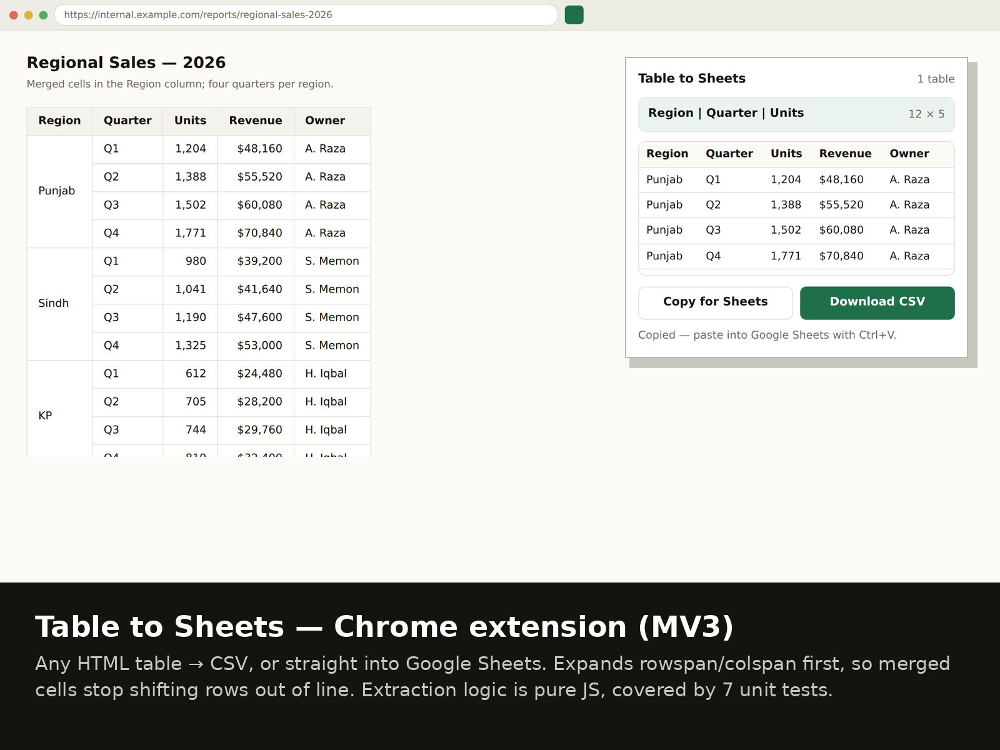

# Table to Sheets — CSV Exporter (Chrome MV3)

[](https://github.com/skmalikllc/table-to-sheets/actions/workflows/tests.yml)
[](LICENSE)

Pulls any HTML table off the current page and hands it to you as CSV, or as a
clipboard payload you can paste straight into Google Sheets.

The part that usually breaks in "copy the table" tools is merged cells: a
`rowspan` silently shifts every following row one column to the left, so the
spreadsheet looks fine until someone sorts it. This extension expands
`rowspan`/`colspan` into a proper rectangle first, then exports.

> **Open-source utility.** Built and maintained by me as a working tool, not a
> client deliverable. Everything in this repository runs.



## Features

- **Merged cells handled first.** `rowspan` and `colspan` are expanded into a
  rectangular matrix before anything is exported, so row alignment survives.
- **Finds the real tables.** Skips layout tables (a table whose cells contain
  another table) and single-row tables; lists what is left with a preview so you
  pick the right one.
- **Download CSV.** RFC 4180 quoting, UTF-8 BOM so Excel opens Urdu and accented
  text correctly, filename derived from the page title and date.
- **Copy for Sheets.** Tab-separated to the clipboard; `Ctrl+V` in Google Sheets
  lands each value in its own cell.
- **No network calls.** Nothing leaves the browser.

## Example

A report table where the Region column is merged across four quarters:

| Region | Quarter | Units | Revenue | Owner |
|---|---|---|---|---|
| Punjab | Q1 | 1,204 | $48,160 | A. Raza |
| *(merged)* | Q2 | 1,388 | $55,520 | A. Raza |
| *(merged)* | Q3 | 1,502 | $60,080 | A. Raza |

A naive copy leaves the merged cells empty and shifts every following row one
column left. This extension exports:

```csv
Region,Quarter,Units,Revenue,Owner
Punjab,Q1,"1,204","$48,160",A. Raza
Punjab,Q2,"1,388","$55,520",A. Raza
Punjab,Q3,"1,502","$60,080",A. Raza
```

Every row carries its own region, and the commas inside the numbers are quoted
rather than splitting the column.

## Use cases

- Lifting a report table out of an admin panel or dashboard that has no export
  button.
- Getting a wiki, documentation or government-portal table into a spreadsheet
  without retyping it.
- Pulling a supplier or price list off a vendor page as the first step of a data
  migration.
- Grabbing a paginated table one page at a time when an API is not available.

## Who this is useful for

Anyone who works in spreadsheets and keeps meeting tables on the web that cannot
be exported: operations and finance staff, VAs, analysts, and anyone doing data
migration work where the source is a web page.

## Architecture

```
manifest.json      MV3 manifest — activeTab, scripting, downloads, clipboardWrite
popup.html/.js     UI: table list, preview, export buttons
content.js         injected on click; returns the matrices to the popup
src/extract.js     pure extraction + CSV/TSV logic (no browser APIs)
test/              node:test unit tests over jsdom
.github/workflows  CI: npm ci + npm test on Node 22 and 24
```

```
page  ──click──▶  content.js  ──matrices──▶  popup.js  ──▶  CSV file
                      │                          │
                 src/extract.js             clipboard (TSV) ──▶ Google Sheets
```

`src/extract.js` holds no browser APIs on purpose, so the awkward parts — merged
cells, quoting, table detection — are unit-tested outside Chrome.

## Installation (unpacked)

```bash
git clone https://github.com/skmalikllc/table-to-sheets.git
```

1. Open `chrome://extensions` and enable **Developer mode**
2. **Load unpacked** → select the cloned folder
3. Open a page with a table and click the toolbar icon

Not published to the Chrome Web Store.

## Testing

```bash
npm install
npm test
```

7 tests cover `rowspan`/`colspan` expansion, CSV quoting (commas, quotes,
newlines), TSV flattening, and table detection. The same command runs in CI on
Node 22 and Node 24 — the badge above is that workflow.

## Security and privacy

| Permission | Reason |
|---|---|
| `activeTab` + `scripting` | read tables from the tab you clicked on, only on click |
| `downloads` | save the CSV |
| `clipboardWrite` | the "Copy for Sheets" button |

No host permissions, no background page, no analytics, no network calls. The
extension only reads the page you are looking at, only after you click the
icon, and the data goes to your download folder or your clipboard — nowhere
else.

## Licence

MIT — see [LICENSE](LICENSE).
